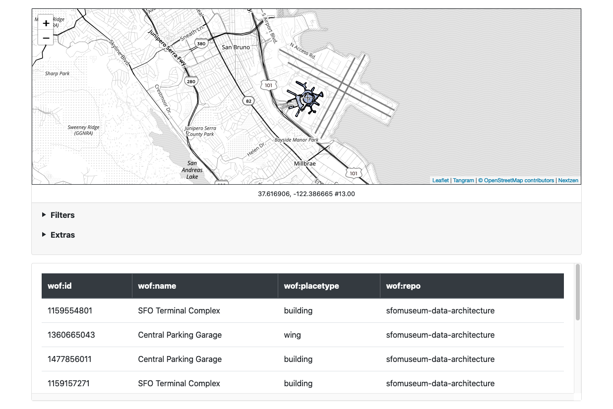

# go-whosonfirst-spatial-http-sqlite

## Important

This is work in progress and not properly documented yet.

## Tools

### server

```
> ./bin/server -h
  -custom-placetypes string
    	...
  -custom-placetypes-source string
    	...
  -enable-candidates
    	Enable the /candidates endpoint to return candidate bounding boxes (as GeoJSON) for requests.
  -enable-custom-placetypes
    	...
  -enable-geojson
    	Allow users to request GeoJSON FeatureCollection formatted responses.
  -enable-properties
    	Enable support for 'properties' parameters in queries.
  -enable-www
    	Enable the interactive /debug endpoint to query points and display results.
  -exclude value
    	Exclude (WOF) records based on their existential flags. Valid options are: ceased, deprecated, not-current, superseded.
  -initial-latitude float
    	... (default 37.616906)
  -initial-longitude float
    	... (default -122.386665)
  -initial-zoom int
    	... (default 13)
  -is-wof
    	Input data is WOF-flavoured GeoJSON. (Pass a value of '0' or 'false' if you need to index non-WOF documents. (default true)
  -mode string
    	Valid modes are: . (default "repo://")
  -nextzen-apikey string
    	A valid Nextzen API key
  -nextzen-style-url string
    	... (default "/tangram/refill-style.zip")
  -nextzen-tile-url string
    	... (default "https://{s}.tile.nextzen.org/tilezen/vector/v1/512/all/{z}/{x}/{y}.mvt")
  -properties-reader-uri string
    	Valid options are: [sqlite://]
  -server-uri string
    	A valid aaronland/go-http-server URI. (default "http://localhost:8080")
  -setenv
    	Set flags from environment variables.
  -spatial-database-uri string
    	Valid options are: [sqlite://] (default "sqlite://")
  -static-prefix string
    	Prepend this prefix to URLs for static assets.
  -strict
    	Be strict about flags and fail if any are missing or deprecated flags are used.
  -templates string
    	An optional string for local templates. This is anything that can be read by the 'templates.ParseGlob' method.
  -verbose
    	Be chatty.
  -www-path string
    	The URL path for the interactive debug endpoint. (default "/debug")
```

For example:

```
$> bin/server \
	-enable-www \
	-enable-properties \
	-spatial-database-uri 'sqlite:///?dsn=/usr/local/data/sfomuseum-data-architecture.db' \
	-properties-reader-uri 'sqlite:///?dsn=/usr/local/data/sfomuseum-data-architecture.db' \
	-nextzen-apikey {NEXT_APIKEY} \
	-mode directory://
```

And then when you visit `http://localhost:8080` in your web browser you should see something like this:



If you don't need, or want, to expose a user-facing interface simply remove the `-enable-www` and `-nextzen-apikey` flags. For example:

```
$> bin/server \
	-enable-properties \
	-spatial-database-uri 'sqlite:///?dsn=/usr/local/data/sfomuseum-data-architecture.db' \
	-properties-reader-uri 'sqlite:///?dsn=/usr/local/data/sfomuseum-data-architecture.db' \
	-mode directory://
```

And then to query the point-in-polygon API you would do something like this:

```
$> curl 'http://localhost:8080/api/point-in-polygon?latitude=37.61701894316063&longitude=-122.3866653442383'

{
  "places": [
    {
      "wof:id": 1360665043,
      "wof:parent_id": -1,
      "wof:name": "Central Parking Garage",
      "wof:placetype": "wing",
      "wof:country": "US",
      "wof:repo": "sfomuseum-data-architecture",
      "wof:path": "136/066/504/3/1360665043.geojson",
      "wof:superseded_by": [],
      "wof:supersedes": [
        1360665035
      ],
      "mz:uri": "https://data.whosonfirst.org/136/066/504/3/1360665043.geojson",
      "mz:latitude": 37.616332,
      "mz:longitude": -122.386047,
      "mz:min_latitude": 37.61498599208708,
      "mz:min_longitude": -122.38779093748578,
      "mz:max_latitude": 37.61767331604971,
      "mz:max_longitude": -122.38429192207244,
      "mz:is_current": 0,
      "mz:is_ceased": 1,
      "mz:is_deprecated": 0,
      "mz:is_superseded": 0,
      "mz:is_superseding": 1,
      "wof:lastmodified": 1547232156
    }
    ... and so on
}    
```

Or:

```
$> curl 'http://localhost:8080/api/point-in-polygon?latitude=37.61701894316063&longitude=-122.3866653442383&format=geojson'

{
  "type": "FeatureCollection",
  "features": [
    {
      "type": "Feature",
      "geometry": {
        "type": "MultiPolygon",
        "coordinates": [ ...omitted for the sake of brevity ]
      },
      "properties": {
        "mz:is_ceased": 1,
        "mz:is_current": 0,
        "mz:is_deprecated": 0,
        "mz:is_superseded": 0,
        "mz:is_superseding": 1,
        "mz:latitude": 37.616332,
        "mz:longitude": -122.386047,
        "mz:max_latitude": 37.61767331604971,
        "mz:max_longitude": -122.38429192207244,
        "mz:min_latitude": 37.61498599208708,
        "mz:min_longitude": -122.38779093748578,
        "mz:uri": "https://data.whosonfirst.org/136/066/504/3/1360665043.geojson",
        "wof:country": "US",
        "wof:id": 1360665043,
        "wof:lastmodified": 1547232156,
        "wof:name": "Central Parking Garage",
        "wof:parent_id": -1,
        "wof:path": "136/066/504/3/1360665043.geojson",
        "wof:placetype": "wing",
        "wof:repo": "sfomuseum-data-architecture",
        "wof:superseded_by": [],
        "wof:supersedes": [
          1360665035
        ]
      }
    }
    ... and so on
  ]
}  
```

## See also

* https://github.com/whosonfirst/go-whosonfirst-spatial
* https://github.com/whosonfirst/go-whosonfirst-spatial-http
* https://github.com/whosonfirst/go-whosonfirst-spatial-sqlite
* https://github.com/whosonfirst/go-whosonfirst-sqlite-features-index
* https://developers.nextzen.org/
